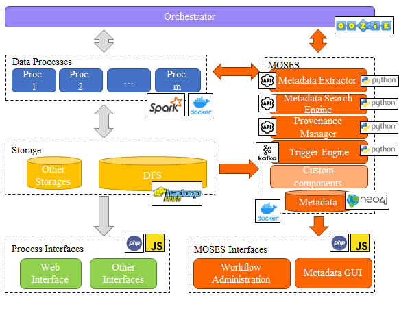
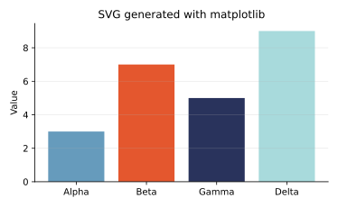

# Main slide

:::: {.columns}

::: {.column width="40%"}
Left column
[@DBLP:journals/eswa/FranciaGG24]

- Nested level 1
  - Nested level 2
    - Nested level 3
    - Nested level 3
  - Nested level 2
- Nested level 1
:::

::: {.column width="60%"}
Right column

- Nested level 1
  - Nested level 2
    - Nested level 3
    - Nested level 3
  - Nested level 2
- Nested level 1
:::

::::

## This is some latex

- $A \in \{0, 1\}$
- $$A \in \{0, 1\}$$

# This is embedded



## A Section

Bbb




---

## A Section

Xxx

### A subsection

Ccc

---

### A subsection

Yyy

---

#### A subsubsection

Ddd

---

## A subsubsubsection

Eee

---

# Some other slides


```js
let a = 1;
let b = 2;
let c = x => 1 + 2 + x;
c(3);
```

# Python generated SVG

:::: {.columns}

::: {.column width="48%"}
::: {.card style="padding: 1rem; border: 1px solid #d9dde7; border-radius: 8px;"}
#### Executed Python

```{python}
#| echo: true
#| output: false
from pathlib import Path
import matplotlib.pyplot as plt

output = Path("generated-python.svg")

fig, ax = plt.subplots(figsize=(5.2, 3.2))
categories = ["Alpha", "Beta", "Gamma", "Delta"]
values = [3, 7, 5, 9]

ax.bar(categories, values, color=["#669BBC", "#E4572E", "#29335C", "#A8DADC"])
ax.set_title("SVG generated with matplotlib")
ax.set_ylabel("Value")
ax.spines[["top", "right"]].set_visible(False)
ax.grid(axis="y", alpha=0.25)

fig.tight_layout()
fig.savefig(output, format="svg")
plt.close(fig)
```
:::
:::

::: {.column width="52%"}
::: {.card style="padding: 1rem; border: 1px solid #d9dde7; border-radius: 8px;"}
#### Generated SVG

{fig-alt="A matplotlib bar chart exported as an SVG by Python."}
:::
:::

::::

# References
